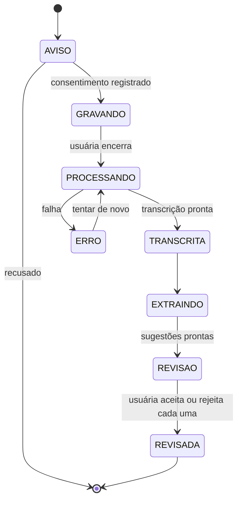
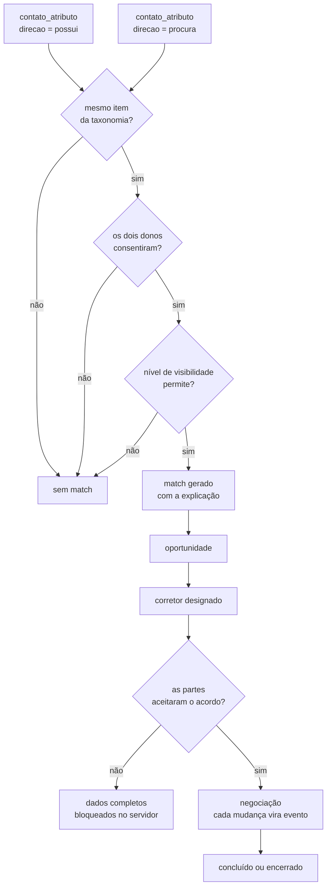
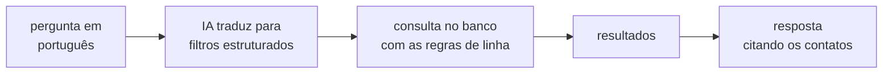

# Fluxos — MMM

Os dois fluxos que dão trabalho de verdade: o Assistente de Reuniões (etapa 3) e o
Smart Match até o corretor (etapas 7, 12 e 13).

---

## Assistente de Reuniões

### Passo a passo

1. **Aviso e consentimento.** Antes de gravar, a tela avisa que a reunião será
   gravada. O aceite grava a versão do texto em `reuniao.consentimento_documento_id`.
   Sem isso, não grava.
2. **Gravação.** Áudio vai para storage cifrado. `reuniao.audio_url` guarda a
   referência, não o arquivo.
3. **Transcrição.** Serviço de fala-para-texto, resultado em `reuniao_transcricao`
   com o idioma, o provedor e a confiança.
4. **Extração.** Sobre a transcrição — nunca sobre o áudio — a IA identifica os sete
   tipos que a Glenda listou: pessoa, empresa, telefone, e-mail, oportunidade,
   produto, setor. Cada achado vira uma linha em `reuniao_extracao` **com o trecho
   da transcrição de onde saiu**.
5. **Revisão.** O app pergunta, item por item: *"Você conheceu João Silva. Deseja
   adicioná-lo à sua rede?"* Aceitar cria o `contato` com os campos pré-preenchidos.
   Rejeitar marca `status='rejeitado'` e a linha fica — é ela que ensina o que a IA
   está errando.

### As três travas

| Trava | Por quê |
|---|---|
| `trecho_origem` é obrigatório | Se a IA não aponta de onde tirou, não sugere. É o que impede um telefone inventado de virar cadastro. |
| Nada é criado sem confirmação | A usuária é a revisora. O erro da IA morre na tela de revisão, não no banco. |
| O que veio da IA fica marcado | `contato_atributo.origem` distingue o que ela digitou do que a IA extraiu. Muda o quanto se confia no dado depois. |

> **Sobre alucinação.** Um modelo de linguagem produz texto plausível com muita
> facilidade, inclusive um número de telefone que ninguém falou. As três travas acima
> não são excesso de zelo: são o que separa "assistente que ajuda" de "assistente que
> polui a base com dado inventado que ninguém vai conseguir identificar depois".

---

## Smart Match até o corretor

### Os dois portões

Um match só existe se passar por **consentimento** (etapa 11) e por **visibilidade**
(etapa 10). Os dois são condições da consulta, não checagens na aplicação — assim um
esquecimento no código não vira vazamento.

### O funil do corretor

Os sete status da etapa 12: `em_analise` → `primeiro_contato` → `reuniao_agendada` →
`negociacao` → `proposta_apresentada` → `concluido` | `encerrado`.

Cada transição grava uma linha em `oportunidade_evento` com quem mudou e quando. Os
cinco indicadores que a Glenda pediu saem daí:

| Indicador | De onde sai |
|---|---|
| matches gerados | `COUNT(*)` em `match` |
| taxa de conversão | oportunidades `concluido` ÷ total |
| tempo médio de negociação | primeiro e último `oportunidade_evento` de cada uma |
| valor estimado intermediado | `SUM(valor_estimado)` das concluídas |
| desempenho por corretor | as métricas acima agrupadas por `corretor_usuario_id` |

Nenhum deles precisa de trabalho extra — desde que as transições sejam gravadas como
eventos desde o primeiro dia. Se o status for apenas sobrescrito, "tempo médio de
negociação" fica impossível de calcular depois, e não tem como recuperar.

### O portão do acordo (etapa 13)

> O acesso às informações completas da oportunidade ocorrerá somente após a
> aceitação do acordo eletrônico.

"Somente após" precisa valer **no servidor**. Antes do aceite, a resposta da API não
contém os dados de contato da outra parte — não é uma tela desabilitada.

---

## Busca em linguagem natural (etapas 6 e 9)

O ponto importante: **a IA monta o filtro, o banco devolve os dados.** A IA nunca é
a fonte da resposta.

"Quem conheci em Santiago que trabalha com mineração?" vira
`contexto.cidade = 'Santiago'` + `contato_atributo.item_id = <mineração>`, e o
resultado sai da consulta.

Isso resolve dois problemas de uma vez: as regras de linha continuam valendo (a IA
não tem como driblar o que o banco não devolve), e a IA não consegue inventar um
contato que não existe — se a consulta voltar vazia, a resposta é "não encontrei".
