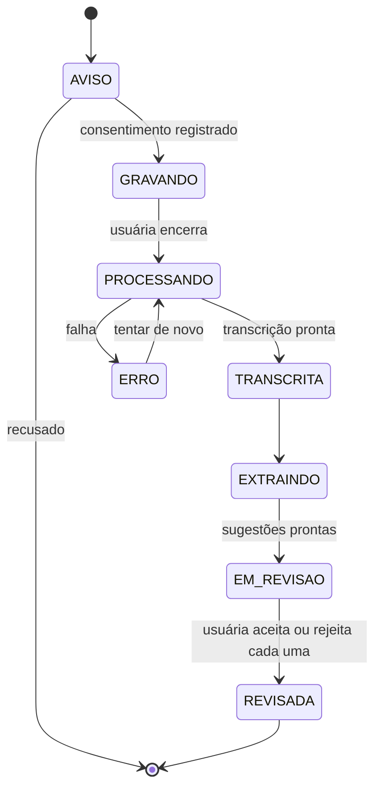
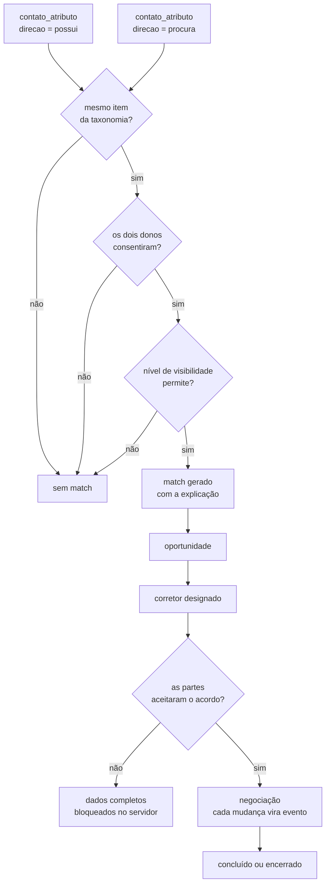
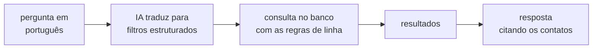

# Fluxos

Cobre o Assistente de Reuniões (etapa 3) e o Smart Match até o corretor (etapas 7,
12 e 13).

---

## Assistente de Reuniões

Os estados do diagrama correspondem aos valores de `reuniao.status` no modelo de
dados.

### Passo a passo

1. **Aviso e consentimento.** Antes de gravar, a tela avisa que a reunião será
   gravada. O aceite grava a versão do texto em `reuniao.consentimento_documento_id`.
   Sem isso, não grava.
2. **Gravação.** Áudio vai para storage cifrado. `reuniao.audio_url` guarda a
   referência, não o arquivo.
3. **Transcrição.** Serviço de fala-para-texto, resultado em `reuniao_transcricao`
   com o idioma, o provedor e a confiança.
4. **Extração.** Sobre a transcrição, nunca sobre o áudio, a IA identifica os sete
   tipos listados no escopo: pessoa, empresa, telefone, e-mail, oportunidade,
   produto, setor. Cada achado vira uma linha em `reuniao_extracao` com o trecho da
   transcrição de onde saiu.
5. **Revisão.** O app pergunta, item por item: *"Você conheceu João Silva. Deseja
   adicioná-lo à sua rede?"* Aceitar cria o `contato` com os campos pré-preenchidos.
   Rejeitar marca `status='rejeitado'` e a linha fica; é ela que mostra o que a IA
   está errando.

### As três travas

| Trava | Por quê |
|---|---|
| `trecho_origem` é obrigatório | Sem origem apontada, não há sugestão. |
| Nada é criado sem confirmação | A usuária é a revisora. O erro da IA morre na tela de revisão, não no banco. |
| O que veio da IA fica marcado | `contato_atributo.origem` distingue o que ela digitou do que a IA extraiu. Muda o quanto se confia no dado depois. |

---

## Smart Match até o corretor

### Condições do match

Um match só existe se passar por consentimento (etapa 11) e por visibilidade
(etapa 10). Os dois são condições da consulta, não checagens na aplicação; assim um
esquecimento no código não vira vazamento. A consulta completa está em
privacidade.md.

### O passo do distribuidor (pedido de interesse, 13/09/2026)

No cruzamento de perfis do site, o clique em "Demonstrar Interesse" não vai direto
à outra pessoa: uma pessoa real com o poder de distribuição (`users.isDistributor`)
confere o par e só então encaminha. Máquina de estados de `connections.status`:

| De | Para | Quem | Trava (WHERE) | Efeitos |
|---|---|---|---|---|
| — | `in_review` | solicitante (`connections.send`) | posse do `matchId` + termo do alvo | aviso aos distribuidores ativos (ou à presidência, se não houver nenhum) |
| `in_review` A→B | `in_review` + `reciprocatedAt` | B clicando em A | `id AND status = 'in_review' AND reciprocatedAt IS NULL` | nenhum; resposta idêntica |
| `in_review` | `pending` | distribuidor (`distribuicao.decidir`, encaminhar) | `id AND status = 'in_review' AND reciprocatedAt IS NULL` + termo, conta ativa e portão da demanda expressa | `interest_received` a B; `system` a A; `MATCH_REVIEW_APPROVED` |
| `in_review` + `reciprocatedAt` | `accepted` | distribuidor (encaminhar) | `id AND status = 'in_review' AND reciprocatedAt IS NOT NULL` + as mesmas travas | 2× `MATCH_IDENTITY_REVEALED` (`via: distribuidor`); aviso aos dois |
| `in_review` | `not_forwarded` | distribuidor (não encaminhar, com nota) | `id AND status = 'in_review'` | `system` a A (e a B, se ela também clicou), sem o motivo; B que não clicou não é avisada; `MATCH_REVIEW_REJECTED` |
| `pending` | `accepted` / `declined` | destinatária (`connections.respond`) | `id AND recipientId = ela AND status = 'pending'` | revelação só com 1 linha afetada |
| `pending` A→B | `accepted` | B por `send` | `id AND status = 'pending'` | `via: interesse_mutuo` |
| `not_forwarded` A→B, sem `reciprocatedAt` | + linha nova B→A `in_review` | B clicando em A | nenhuma linha de B no par | aviso a quem distribui (menos as partes); o par passa a ter duas linhas |
| terminais | — | — | 0 linhas afetadas | `send` responde igual; `decidir` → CONFLICT |

O que cada lado vê é o que a consulta devolve (`pedidoVisivelPara`, em `db.ts`):

| Linha | Solicitante | Destinatária | Distribuidor |
|---|---|---|---|
| `in_review` | "Em análise" (desabilitado) | **nada** | fila |
| `in_review` + `reciprocatedAt` | "Em análise" | "Em análise" | fila, com "interesse recíproco" |
| `pending` | "Interesse enviado — aguardando" | "Demonstrou interesse em você" + aceitar/recusar | histórico |
| `accepted` | nome | nome | histórico |
| `declined` | "Interesse não aceito" | — | histórico |
| `not_forwarded` | "Interesse não encaminhado" | **nada** | histórico |
| `not_forwarded` + `reciprocatedAt` | "Interesse não encaminhado" | "Interesse não encaminhado" | histórico |

O distribuidor que é parte de um pedido não o vê na fila nem no histórico e não é
avisado dele. Com duas linhas no par, o cartão mostra a mais recente entre as que
cada pessoa pode ver.

Sem distribuidor que possa decidir (nenhum ativo, ou só as próprias partes), o pedido
fica esperando (nunca passa sem análise) e president/admin ativos recebem o aviso
para conceder o poder no Painel Ouro.

### O funil do corretor

Os sete status da etapa 12: `em_analise` → `primeiro_contato` → `reuniao_agendada` →
`negociacao` → `proposta_apresentada` → `concluido` | `encerrado`.

Cada transição grava uma linha em `oportunidade_evento` com quem mudou e quando. Os
cinco indicadores pedidos no escopo saem daí:

| Indicador | De onde sai |
|---|---|
| matches gerados | `COUNT(*)` em `match` |
| taxa de conversão | oportunidades `concluido` ÷ total |
| tempo médio de negociação | primeiro e último `oportunidade_evento` de cada uma |
| valor estimado intermediado | `SUM(valor_estimado)` das concluídas |
| desempenho por corretor | as métricas acima agrupadas por `corretor_usuario_id` |

Nenhum deles precisa de trabalho extra, desde que as transições sejam gravadas como
eventos desde o primeiro dia. Se o status for apenas sobrescrito, o tempo médio de
negociação fica incalculável, sem como recuperar.

### Acesso após o aceite (etapa 13)

> O acesso às informações completas da oportunidade ocorrerá somente após a
> aceitação do acordo eletrônico.

"Somente após" precisa valer no servidor: antes do aceite de todas as partes, a
resposta da API não contém os dados de contato da outra parte. A política que impõe
isso está em privacidade.md.

---

## Busca em linguagem natural (etapas 6 e 9)

O ponto importante: a IA monta o filtro, o banco devolve os dados. A IA nunca é a
fonte da resposta.

"Quem conheci em Santiago que trabalha com mineração?" vira
`contexto.cidade = 'Santiago'` + `contato_atributo.item_id = <mineração>`, e o
resultado sai da consulta.

Isso resolve dois problemas de uma vez: as regras de linha continuam valendo (a IA
não tem como driblar o que o banco não devolve), e a IA não consegue inventar um
contato que não existe. Se a consulta voltar vazia, a resposta é "não encontrei".
