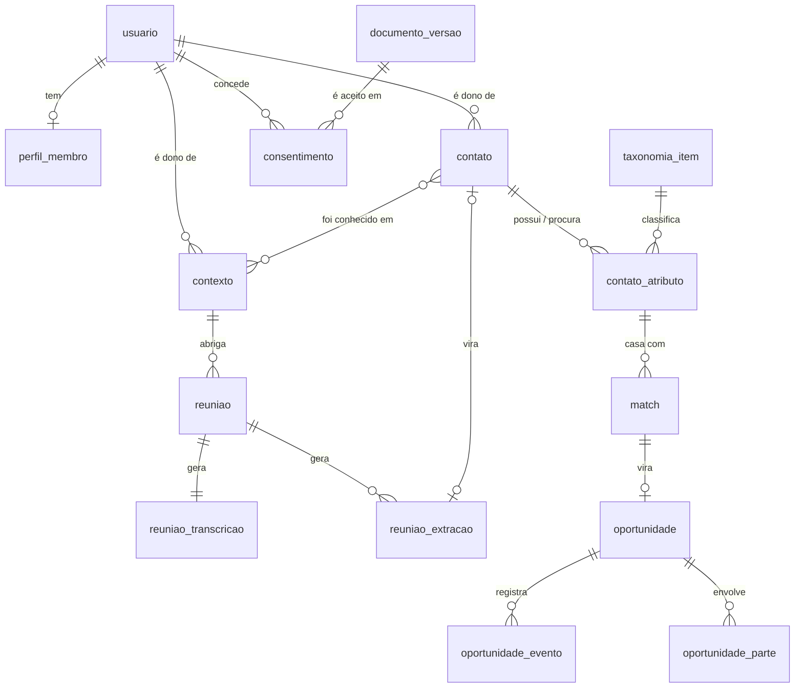

# Modelo de dados — MMM

Postgres. DDL simplificado: índices, regras de linha e triggers de auditoria estão
descritos em [privacidade.md](./privacidade.md) e omitidos aqui para o desenho ficar
legível.

As tabelas estão agrupadas por assunto, para leitura. **Na hora de criar de verdade,
a ordem é outra**, porque uma tabela não pode referenciar outra que ainda não existe:

```
taxonomia_item → taxonomia_sinonimo → usuario → usuario_papel → documento_versao
→ perfil_membro → perfil_membro_area → contato → contato_atributo
→ contexto → contexto_contato → contexto_arquivo
→ reuniao → reuniao_transcricao → reuniao_extracao
→ consentimento → match → oportunidade → oportunidade_evento → oportunidade_parte
→ autorizacao_ouro → compartilhamento → auditoria
```

## Visão geral das entidades



---

## Identidade e papéis

```sql
CREATE TABLE usuario (
  id          uuid PRIMARY KEY DEFAULT gen_random_uuid(),
  nome        text NOT NULL,
  email       text UNIQUE NOT NULL,
  telefone    text,
  ativo       boolean NOT NULL DEFAULT true,
  criado_em   timestamptz NOT NULL DEFAULT now()
);

-- Papéis são acumuláveis: alguém pode ser Ouro e Corretor ao mesmo tempo.
-- Por isso é tabela, não uma coluna "perfil" em usuario.
CREATE TABLE usuario_papel (
  usuario_id     uuid NOT NULL REFERENCES usuario(id) ON DELETE CASCADE,
  papel          text NOT NULL CHECK (papel IN ('membro','ouro','corretor','admin')),
  concedido_em   timestamptz NOT NULL DEFAULT now(),
  concedido_por  uuid REFERENCES usuario(id),
  revogado_em    timestamptz,
  PRIMARY KEY (usuario_id, papel)
);
```

## Perfil do membro

É aqui que moram os ajustes A4 a A8 das notas do Gabriel. Separado de `usuario`
porque são dados de negócio, não de autenticação.

```sql
CREATE TABLE perfil_membro (
  usuario_id          uuid PRIMARY KEY REFERENCES usuario(id) ON DELETE CASCADE,
  natureza            text CHECK (natureza IN ('PF','PJ','MEI','terceiro_setor')),  -- A6
  cnpj                text,                                                          -- A7
  porte               text CHECK (porte IN ('MEI','micro','pequena','media','grande')),
  genero              text CHECK (genero IN ('masculino','feminino','nao_informado')),-- A4
  setor_principal_id  uuid REFERENCES taxonomia_item(id),                            -- A5
  setor_texto_livre   text,                    -- A5: quando não está na lista
  modalidades         text[] NOT NULL DEFAULT '{}',  -- A8: {'presencial','online'}
  atualizado_em       timestamptz NOT NULL DEFAULT now(),

  -- CNPJ obrigatório para PJ e MEI, proibido para PF
  CONSTRAINT cnpj_coerente CHECK (
    (natureza IN ('PJ','MEI') AND cnpj IS NOT NULL)
    OR (natureza NOT IN ('PJ','MEI') AND cnpj IS NULL)
  )
);

-- A1, A2, A3: mínimo 1, máximo 5 áreas. O limite é validado por trigger,
-- porque CHECK não consegue contar linhas de outra tabela.
CREATE TABLE perfil_membro_area (
  usuario_id  uuid NOT NULL REFERENCES usuario(id) ON DELETE CASCADE,
  area_id     uuid NOT NULL REFERENCES taxonomia_item(id),
  PRIMARY KEY (usuario_id, area_id)
);
```

---

## Taxonomia — o coração do Match

```sql
CREATE TABLE taxonomia_item (
  id          uuid PRIMARY KEY DEFAULT gen_random_uuid(),
  tipo        text NOT NULL CHECK (tipo IN ('area','setor','ativo','necessidade')),
  pai_id      uuid REFERENCES taxonomia_item(id),
  nome        text NOT NULL,
  slug        text NOT NULL,          -- normalizado, sem acento: 'terras-raras'
  ativo       boolean NOT NULL DEFAULT true,
  criado_em   timestamptz NOT NULL DEFAULT now(),
  UNIQUE (tipo, slug)
);

-- Faz 'terras raras', 'terra rara' e 'rare earth' caírem no mesmo item.
CREATE TABLE taxonomia_sinonimo (
  item_id  uuid NOT NULL REFERENCES taxonomia_item(id) ON DELETE CASCADE,
  termo    text NOT NULL,
  PRIMARY KEY (item_id, termo)
);
```

> **Nota de modelagem.** `ativo` em vez de `DELETE`: desativar um item da lista não
> pode apagar o atributo de ninguém. Contatos antigos continuam apontando para o item
> desativado, ele só deixa de aparecer em cadastros novos.

---

## Contatos e atributos estratégicos

```sql
CREATE TABLE contato (
  id                   uuid PRIMARY KEY DEFAULT gen_random_uuid(),
  dono_usuario_id      uuid NOT NULL REFERENCES usuario(id) ON DELETE CASCADE,
  -- Quando o contato também é membro do MMM, aponta para ele.
  -- O perfil da própria usuária é um contato cujo dono e vinculado são ela mesma.
  usuario_vinculado_id uuid REFERENCES usuario(id),

  nome           text NOT NULL,
  empresa        text,
  cargo          text,
  pais           text,
  cidade         text,
  telefone       text,
  whatsapp       text,
  email          text,
  linkedin       text,
  instagram      text,
  observacoes    text,
  foto_url       text,
  cartao_url     text,          -- cartão de visita

  nivel_visibilidade text NOT NULL DEFAULT 'privado'
    CHECK (nivel_visibilidade IN ('privado','ouro','publico')),

  criado_em      timestamptz NOT NULL DEFAULT now(),
  atualizado_em  timestamptz NOT NULL DEFAULT now()
);

-- Etapa 2 e ajuste A9: as duas pontas na MESMA tabela, distinguidas por direcao.
-- É isso que torna a consulta de Match simétrica e faz A9 sair de graça.
CREATE TABLE contato_atributo (
  id             uuid PRIMARY KEY DEFAULT gen_random_uuid(),
  contato_id     uuid NOT NULL REFERENCES contato(id) ON DELETE CASCADE,
  direcao        text NOT NULL CHECK (direcao IN ('possui','procura')),

  item_id        uuid REFERENCES taxonomia_item(id),
  texto_livre    text,          -- fora do cruzamento; alimenta revisão da lista

  origem         text NOT NULL DEFAULT 'manual'
                 CHECK (origem IN ('manual','reuniao','ia')),
  origem_id      uuid,          -- aponta para reuniao_extracao quando origem <> manual
  confianca      numeric CHECK (confianca BETWEEN 0 AND 1),
  criado_em      timestamptz NOT NULL DEFAULT now(),

  -- Um atributo precisa ser da lista OU texto livre. Nunca vazio.
  CONSTRAINT tem_conteudo CHECK (item_id IS NOT NULL OR texto_livre IS NOT NULL)
);
```

> **Por que `direcao` em vez de duas tabelas.** Com uma tabela só, o Match é um
> `JOIN` da tabela nela mesma: `a.direcao='possui' AND b.direcao='procura' AND
> a.item_id = b.item_id`. Com duas tabelas, e mais duas para o perfil do membro, o
> mesmo cruzamento vira quatro consultas diferentes que precisam ficar em sincronia.
> É a diferença entre o Match ser uma consulta e ser um problema.

---

## Contexto (etapa 5)

```sql
CREATE TABLE contexto (
  id               uuid PRIMARY KEY DEFAULT gen_random_uuid(),
  dono_usuario_id  uuid NOT NULL REFERENCES usuario(id) ON DELETE CASCADE,
  tipo             text NOT NULL,   -- congresso, missao, embaixada, evento_mmm...
  nome             text NOT NULL,
  data             date,
  cidade           text,            -- responde "quem conheci em Santiago?"
  pais             text,
  observacoes      text,
  criado_em        timestamptz NOT NULL DEFAULT now()
);

CREATE TABLE contexto_contato (
  contexto_id  uuid NOT NULL REFERENCES contexto(id) ON DELETE CASCADE,
  contato_id   uuid NOT NULL REFERENCES contato(id)  ON DELETE CASCADE,
  PRIMARY KEY (contexto_id, contato_id)
);

CREATE TABLE contexto_arquivo (
  id           uuid PRIMARY KEY DEFAULT gen_random_uuid(),
  contexto_id  uuid NOT NULL REFERENCES contexto(id) ON DELETE CASCADE,
  url          text NOT NULL,
  tipo         text NOT NULL CHECK (tipo IN ('foto','documento')),
  criado_em    timestamptz NOT NULL DEFAULT now()
);
```

---

## Reuniões (etapa 3)

```sql
CREATE TABLE reuniao (
  id               uuid PRIMARY KEY DEFAULT gen_random_uuid(),
  dono_usuario_id  uuid NOT NULL REFERENCES usuario(id) ON DELETE CASCADE,
  contexto_id      uuid REFERENCES contexto(id),
  titulo           text,
  iniciada_em      timestamptz NOT NULL DEFAULT now(),
  encerrada_em     timestamptz,
  audio_url        text,
  status           text NOT NULL DEFAULT 'gravando'
                   CHECK (status IN ('gravando','processando','transcrita','revisada','erro')),

  -- Gravar terceiros exige aviso. Registrar QUE o aviso foi dado e em qual versão.
  consentimento_documento_id uuid REFERENCES documento_versao(id),
  consentimento_em           timestamptz
);

CREATE TABLE reuniao_transcricao (
  reuniao_id  uuid PRIMARY KEY REFERENCES reuniao(id) ON DELETE CASCADE,
  texto       text NOT NULL,
  idioma      text NOT NULL DEFAULT 'pt-BR',
  provedor    text,
  confianca   numeric CHECK (confianca BETWEEN 0 AND 1),
  criado_em   timestamptz NOT NULL DEFAULT now()
);

CREATE TABLE reuniao_extracao (
  id                uuid PRIMARY KEY DEFAULT gen_random_uuid(),
  reuniao_id        uuid NOT NULL REFERENCES reuniao(id) ON DELETE CASCADE,
  tipo              text NOT NULL CHECK (tipo IN
                      ('pessoa','empresa','telefone','email','oportunidade','produto','setor')),
  valor             text NOT NULL,

  -- Rastreabilidade obrigatória: de onde na transcrição isso saiu.
  trecho_origem     text NOT NULL,
  offset_inicio     int,
  offset_fim        int,
  confianca         numeric NOT NULL CHECK (confianca BETWEEN 0 AND 1),

  status            text NOT NULL DEFAULT 'sugerido'
                    CHECK (status IN ('sugerido','aceito','rejeitado')),
  contato_gerado_id uuid REFERENCES contato(id),
  revisado_em       timestamptz,
  criado_em         timestamptz NOT NULL DEFAULT now()
);
```

> **`trecho_origem` é `NOT NULL` de propósito.** Se a IA não consegue apontar onde na
> transcrição a informação apareceu, ela não deveria estar sugerindo essa informação.
> É a trava que impede um telefone inventado de virar cadastro.

---

## Consentimento e documentos (etapas 11, 13 e ajuste A11)

```sql
CREATE TABLE documento_versao (
  id           uuid PRIMARY KEY DEFAULT gen_random_uuid(),
  tipo         text NOT NULL CHECK (tipo IN
                 ('termo_smart_match','acordo_intermediacao','contrato_comissao','termo_gravacao')),
  versao       int  NOT NULL,
  texto        text NOT NULL,
  publicado_em timestamptz NOT NULL DEFAULT now(),
  vigente      boolean NOT NULL DEFAULT false,
  UNIQUE (tipo, versao)
);

CREATE TABLE consentimento (
  id                   uuid PRIMARY KEY DEFAULT gen_random_uuid(),
  usuario_id           uuid NOT NULL REFERENCES usuario(id) ON DELETE CASCADE,
  documento_versao_id  uuid NOT NULL REFERENCES documento_versao(id),
  concedido_em         timestamptz NOT NULL DEFAULT now(),
  revogado_em          timestamptz,          -- revogar NUNCA apaga a linha
  ip                   inet,
  user_agent           text
);
```

> **Versionar o documento é o que transforma consentimento em prova.** Guardar só
> "fulano aceitou" não serve: seis meses depois ninguém sabe o que ele aceitou. E
> revogação é uma data preenchida, nunca um `DELETE` — o histórico precisa mostrar
> que houve consentimento no período em que os dados foram usados.
>
> Isso destrava o A11 e a etapa 13 **antes** de o texto jurídico ficar pronto: a
> mecânica se constrói agora, o texto entra como uma linha em `documento_versao`
> quando a Glenda entregar.

---

## Match e oportunidades (etapas 7, 12, 13)

```sql
CREATE TABLE match (
  id                uuid PRIMARY KEY DEFAULT gen_random_uuid(),
  atributo_possui_id  uuid NOT NULL REFERENCES contato_atributo(id) ON DELETE CASCADE,
  atributo_procura_id uuid NOT NULL REFERENCES contato_atributo(id) ON DELETE CASCADE,
  item_id           uuid NOT NULL REFERENCES taxonomia_item(id),  -- o que casou
  score             numeric NOT NULL,
  status            text NOT NULL DEFAULT 'sugerido'
                    CHECK (status IN ('sugerido','descartado','virou_oportunidade')),
  gerado_em         timestamptz NOT NULL DEFAULT now(),
  UNIQUE (atributo_possui_id, atributo_procura_id)
);

CREATE TABLE oportunidade (
  id                  uuid PRIMARY KEY DEFAULT gen_random_uuid(),
  match_id            uuid NOT NULL REFERENCES match(id),
  corretor_usuario_id uuid REFERENCES usuario(id),
  status              text NOT NULL DEFAULT 'em_analise' CHECK (status IN (
                        'em_analise','primeiro_contato','reuniao_agendada',
                        'negociacao','proposta_apresentada','concluido','encerrado')),
  valor_estimado      numeric,
  criado_em           timestamptz NOT NULL DEFAULT now(),
  encerrado_em        timestamptz
);

-- Cada mudança vira um evento. É daqui que saem os cinco indicadores da etapa 12.
CREATE TABLE oportunidade_evento (
  id               uuid PRIMARY KEY DEFAULT gen_random_uuid(),
  oportunidade_id  uuid NOT NULL REFERENCES oportunidade(id) ON DELETE CASCADE,
  de_status        text,
  para_status      text NOT NULL,
  ator_usuario_id  uuid REFERENCES usuario(id),
  observacao       text,
  criado_em        timestamptz NOT NULL DEFAULT now()
);

-- Etapa 13: sem aceite, os dados completos não saem do servidor.
CREATE TABLE oportunidade_parte (
  oportunidade_id      uuid NOT NULL REFERENCES oportunidade(id) ON DELETE CASCADE,
  usuario_id           uuid NOT NULL REFERENCES usuario(id),
  documento_versao_id  uuid REFERENCES documento_versao(id),
  aceito_em            timestamptz,
  PRIMARY KEY (oportunidade_id, usuario_id)
);
```

> **Por que `oportunidade_evento` existe.** A etapa 12 pede "tempo médio de
> negociação" e "taxa de conversão". Se `oportunidade.status` for só sobrescrito,
> essas duas métricas são impossíveis de calcular depois — a informação de quando
> mudou já foi perdida. Gravando cada transição como evento, os cinco indicadores
> saem de uma consulta, sem trabalho extra.

## Auditoria

```sql
CREATE TABLE auditoria (
  id           bigserial PRIMARY KEY,
  ator_usuario_id uuid REFERENCES usuario(id),
  acao         text NOT NULL,       -- criou, alterou, visualizou, exportou
  entidade     text NOT NULL,
  entidade_id  uuid,
  diff         jsonb,
  ip           inet,
  criado_em    timestamptz NOT NULL DEFAULT now()
);
```

Append-only por trigger: sem `UPDATE`, sem `DELETE`. É o registro que sustenta a
governança pedida na etapa 13 e a evidência de contorno do ajuste A13.

---

## A consulta de Match, inteira

O motor da etapa 7, o "maior diferencial do MMM", é isto:

```sql
SELECT
  cp.contato_id       AS contato_possui,
  cs.contato_id       AS contato_procura,
  ti.nome             AS casou_em
FROM contato_atributo cp
JOIN contato_atributo cs
  ON  cs.item_id  = cp.item_id      -- mesma lista controlada dos dois lados
  AND cs.direcao  = 'procura'
  AND cp.direcao  = 'possui'
  AND cs.contato_id <> cp.contato_id
JOIN taxonomia_item ti ON ti.id = cp.item_id
WHERE cp.item_id IS NOT NULL;       -- texto livre não entra no cruzamento
```

`ti.nome` já é a explicação do match ("casaram em: terras raras"), que a etapa 7 pede
que seja exibida. Ela sai da própria consulta, sem precisar ser gerada por IA.

O que falta acima são os filtros de permissão e de consentimento — eles estão em
[privacidade.md](./privacidade.md), e **não são opcionais**: sem eles, o Match cruza
dado que o dono não liberou.
